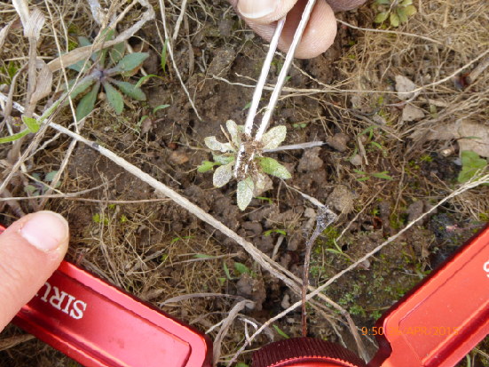

<table>
  <tr><td width="60%" valign="top" align="left">
      This is the Teeny Tiny plant I work on. I love to spends hours and days and...years just looking at it and falling in love with it.
    Every time I look at it I see a new shade of green. I mostly like to look for a white shade though. 
You might ask me how much do I love this teeny tiny thing; well I love it so much that at the end I KILL it :D :D :D
</td>
    <td width="40%" valign="top" style="border: none;">
       H. arabidopsidis</i>  infected <i>A. thaliana</i>"/>
    </td>
  </tr>
</table> 
