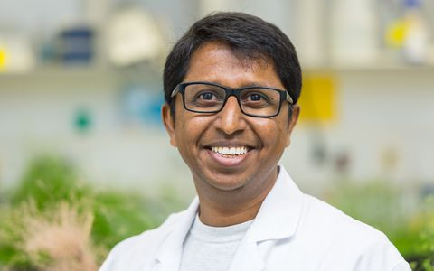

<table height="60%">
  <tr><td width="60%" height="60%" valign="top" align="left">
      I am a Post-Doctoral Researcher at Max Planck Institute for Developmental Biology in the lab of Detlef Weigel; Tuebingen, Germany.
      My research focuses on Teeny tiny plant called -----. I have a broad interest in many ......  
     For more information on my research interests and projects, check out my [Research page]( !
    
    Education:
<ul>
  <li>
      Ph.D. (Dec 2013), The Ohio State University, Columbus, OH
  </li>
  <li>
      MS (xxxx), India
  </li>
  <li>
      BS (xxxx), India
  </li>
</ul>

    
A Special Thank you:

To ....., where I have spent every summer of my Ph.D. conducting my dissertation research. The station has provided funding, housing, lab facilities, close access to my field sites, and a wonderful research community.

</td>
    <td width="40%" height="60%" valign="top" style="border: none;">
      
    </td>
  </tr>
</table>
